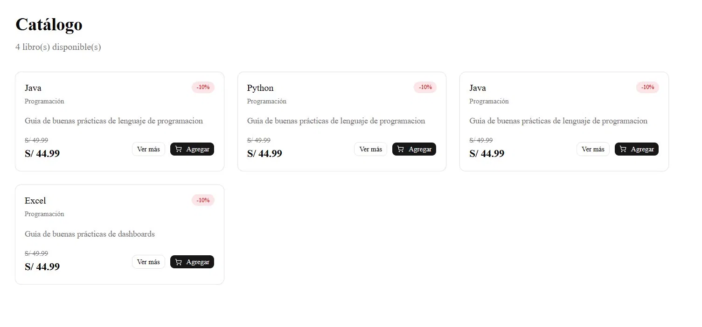

# Librería Trinidad — Frontend

Interfaz web para una tienda online de libros construida con Next.js 16, Tailwind CSS y shadcn/ui. Consume la REST API del backend e incluye flujos de autenticación, carrito, órdenes con descarga en PDF y panel de administración.

## Ecosistema

| Repositorio                                                             | Descripción                                          |
| ----------------------------------------------------------------------- | ---------------------------------------------------- |
| [libreria-trinidad-api](https://github.com/JuanCosco/libreria-trinidad-api)             | REST API con Express + Prisma + PostgreSQL           |
| **libreria-trinidad-web** ← estás aquí                                                  | Frontend Next.js 16 + Tailwind + shadcn              |
| [libreria-trinidad-analytics](https://github.com/JuanCosco/libreria-trinidad-analytics) | Capa analytics con dbt sobre la misma DB del backend |

## Stack

- **Framework:** Next.js 16 (App Router)
- **Lenguaje:** TypeScript
- **Estilos:** Tailwind CSS + shadcn/ui
- **Estado global:** React Context (Auth + Cart)
- **HTTP:** Axios
- **PDF:** jsPDF

## Estructura

app/
├── (public)/ # Catálogo y detalle de libros
├── (auth)/ # Login y registro
├── (protected)/ # Carrito y órdenes (requiere login)
└── admin/ # Panel de administración (requiere ADMIN)
components/
├── ui/ # Componentes shadcn
├── layout/ # Navbar, AuthGuard
└── books/ # BookCard
context/ # AuthContext, CartContext
hooks/ # useAuth, useCart
lib/ # axios, auth helpers, pdf
types/ # Interfaces TypeScript

## Páginas

| Ruta                | Descripción                | Acceso      |
| ------------------- | -------------------------- | ----------- |
| `/`                 | Catálogo de libros         | Público     |
| `/books/:id`        | Detalle del libro          | Público     |
| `/login`            | Iniciar sesión             | Público     |
| `/register`         | Registrarse                | Público     |
| `/cart`             | Carrito de compras         | Autenticado |
| `/orders`           | Mis órdenes + descarga PDF | Autenticado |
| `/admin/books`      | Gestión de libros          | Admin       |
| `/admin/categories` | Gestión de categorías      | Admin       |
| `/admin/orders`     | Gestión de órdenes         | Admin       |

## Screenshots

<!-- Reemplaza con tus capturas reales -->

| Catálogo                                  | Carrito                               | Admin                                |
| ----------------------------------------- | ------------------------------------- | ------------------------------------ |
|  |  |  |

## Instalación

```bash
npm install
cp .env.example .env.local
# Editar .env.local
npm run dev
```

> El backend debe estar corriendo en `http://localhost:3001` antes de iniciar el frontend.

## Variables de entorno

```env
NEXT_PUBLIC_API_URL=http://localhost:3001/api
```
